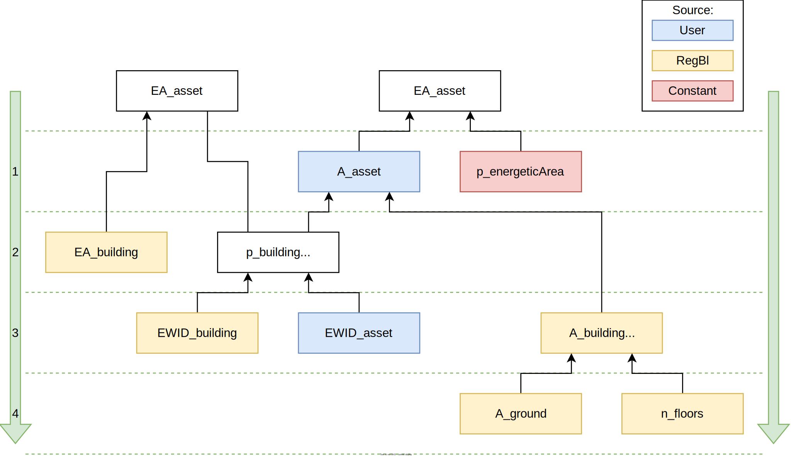

```{r, include = FALSE}
knitr::opts_chunk$set(
  collapse = TRUE,
  comment = "#>"
)

# Load variables used in the vignette
library(BuildingsEmissionsCalculator)
energeticAreaFactor <- get(".constants", asNamespace("BuildingsEmissionsCalculator"))$energeticAreaFactor
```

## Identification du bâtiment

Afin de pouvoir déterminer les émissions de CO2 d'un bien foncier, il est nécessaire d'identifier le ou les bâtiments qui le composent. Plusieurs méthodes d'identification sont utilisées, en fonction des informations fournies par l'utilisateur. Le but est d'identifier le plus souvent possible le bâtiment, en faisant le moins d'erreur possible. Pour se faire, plusieurs méthodes d'identification sont appelé à la suite, jusqu'à ce qu'une identification unqiue soit possible. Si à la fin de multiples bâtiments ont été identifiés par ces méthodes, celui étant ressorti le plus souvent est retenu.  

Il est important de noter que la recherche dans la base de données de RegBl a besoin d'une correspondance exacte. Cela signifie que si un nom de rue est donné, celui-ci doit correspondre exactement à celui enregistrée dans la base de données de RegBl. Des améliorations pourraient être apportées pour permettre une recherche local plus flexible. L'API de recherche d'adresse Swiss GeoAdmin est plus flexible, et permet de trouver des adresses mal orthographiées ou ne corresondant pas exactement. Cependant cette méthode est utilisé en dernier recours, car elle est plus lente, a besoin d'internet, et ne prend pas en compte des données comme le numéro de parcelle.  

Les étapes d'identification sont disponible dans le schéma [egid_search_steps.svg](img/egid_search_steps.svg) ci-dessous.



### Description des étapes

1. Si un numéro EGID est fourni, celui-ci est directement utilisé. Si non, nous passons à l'étape suivante.
1. Si une adresse avec NPA, nom et numéro de rue est donnée, une recherche dans la base de données de RegBl est effectuée pour trouver l'EGID correspondant. Si un EGID unique est trouvé, celui-ci est utilisé. Si plusieurs ou aucun EGID n'est trouvé, nous passons à l'étape suivante.
1. Si un NPA et un numéro de parcelle est donné, une recherche dans la base de données de RegBl est effectuée pour trouver l'EGID correspondant. Si un EGID unique est trouvé, celui-ci est utilisé. Si plusieurs ou aucun EGID n'est trouvé, nous passons à l'étape suivante.
1. Finalement, une recherche est effectuée via l'API de recherche d'adresse Swiss GeoAdmin, en lui fournissant les infos d'adresse connues. Si un EGID unique est trouvé, celui-ci est utilisé. Si aucun EGID n'est trouvé, une erreur est retournée. Si plusieurs EGID sont trouvés, nous passons à l'étape suivante.
1. Si plusieurs EGID ont été trouvés à une des étapes, mais que aucun unique n'a pas être déterminé, l'EGID étant ressorti le plus souvent dans les différentes méthodes d'identification est retenu. Si tout de même plusieurs EGID sont ressortis le même nombre de fois, une erreur est retournée.

## Surface énergétique du bien foncier

Afin de connaître les émissions de CO2 d'un bien foncier, il est nécessaire de déterminer la surface énergétique de celui-ci, ainsi que ses émissions par m2.  
Le calcul des émissions de CO2 par m2 d'un bien foncier est développé dans la documentation du [`co2calculatorPACTA2022`](https://maximecharriere.github.io/co2calculatorPACTA2022/articles/explanations.html).  
Concernant le calcul de la surface énergétique, il est possible de la déterminer de plusieurs manières différentes, en fonction des données fournies. Le calcule de la surface énergétique du bien foncier suit une chaîne d'équations. Si une information nécessaire à une équation n'est pas fournie par l'utilisateur ou RegBl, celle-ci est calculée à partir des autres informations disponibles, et si celles-ci ne sont à leur tour pas disponibles, elles sont calculées à partir d'autres informations, et ainsi de suite.  
Le schéma [`area_calculation.svg`](img/area_calculation.svg) présenté ci-dessous illustre l'ordre des calcules pour déterminer la surface énergétique du bien foncier, et l'importance des données utilisées. Si une information est manquante et ne permet pas d'effectuer un calcule, nous allons plus profondément dans la chaîne d'équations.  
La Description des symboles est disponibles [ici](#description-des-symboles), et les explications des équations sont disponibles [ici](#explications).  



### Description des symboles

| **Symbol**              | **Description**                                     |
|-------------------------|-----------------------------------------------------|
| $EA_{asset}$            | Energetic Area of the real estate asset             |
| $EA_{building}$         | Energetic Area of the building                      |
| $A_{asset}$             | Area of the real estate asset                       |
| $A_{building}$          | Area of the building                                |
| $A_{ground}$            | Ground area                                         |
| $n_{floors}$            | Number of floors                                    |
| $p_{energeticArea}$     | Energetic area factor                               |
| $p_{building}$          | Proportion of the building in the real estate asset |
| $EWID_{building}$       | Number of EWID in the building                      |
| $EWID_{asset}$          | Number of EWID in the real estate asset             |

### Explications

1. Si la surface du bien foncier est donnée par l'utilisateur, la surface énergétique du bien foncier est calculée en multipliant la surface du bien foncier par le facteur de surface énergétique. Ce facteur est fixé à `r energeticAreaFactor`.  
   $$ EA_{asset} = A_{asset} \times p_{energeticArea} $$
2. Si non, et si la surface énergétique du bâtiment est donnée par RegBl, la surface énergétique du bien foncier est calculée en multipliant la surface énergétique du bâtiment par la proportion du bâtiment dans le bien foncier.  
   $$ EA_{asset} = EA_{building} \times p_{building} $$
   La proportion du bâtiment compris dans le bien foncier est calculée en divisant le nombre d'EWID dans le bien foncier, donné par le client, par le nombre d'EWID dans le bâtiment, donné par RegBl. Si une de ces informations n'est pas disponible, il est considéré que tout le bâtiment fait parti du bien foncier ($p_{building}=1.0$).
   $$ p_{building} = \frac{EWID_{asset}}{EWID_{building}} $$
3. Si non, et si la surface du bâtiment est donnée par RegBl, la surface du bien foncier est calculée en multipliant la surface du bâtiment par la proportion du bâtiment dans le bien foncier. Ce dernier est calculé comme vu au point 2.  
    $$ A_{asset} = A_{building} \times p_{building} $$
4. Si non, et si la surface du sol et le nombre d'étages sont donnés par RegBl, la surface du bien foncier est calculée en multipliant la surface du sol par le nombre d'étages. Si une de ces informations n'est pas disponible, une erreur est retournée.  
    $$ A_{building} = A_{ground} \times n_{floors} $$

